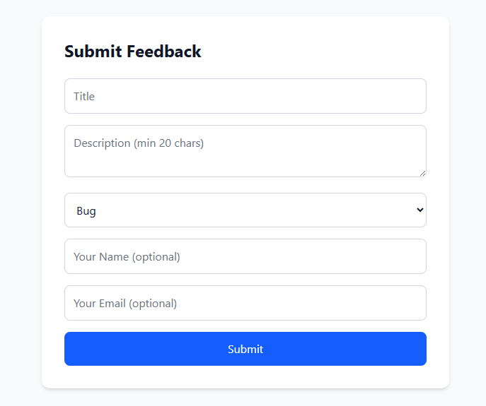
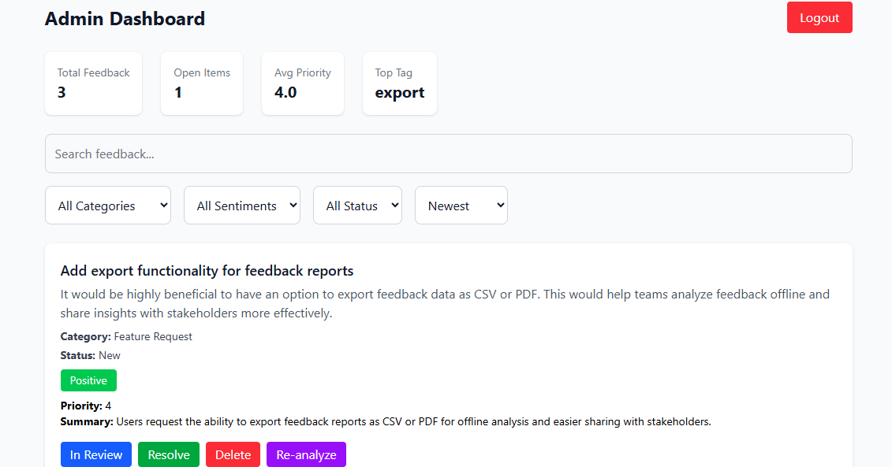
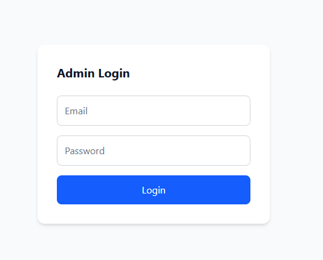
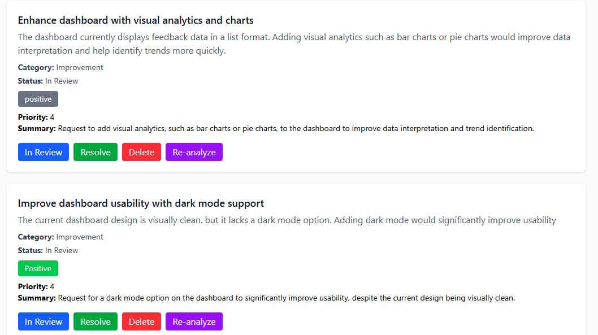

# 🚀 AI-Powered Feedback Management System

A full-stack web application that allows users to submit feedback and enables admins to manage, analyze, and prioritize feedback using AI.

---

## 📌 Project Overview

This system allows:

* Users to submit feedback without authentication
* Automatic AI analysis of feedback (category, sentiment, priority, summary, tags)
* Admin dashboard to manage feedback efficiently
* Filtering, sorting, searching, and analytics for better decision-making

---

## 🛠️ Tech Stack

### Frontend

* Next.js (App Router)
* React (TypeScript)
* Tailwind CSS

### Backend

* Node.js
* Express.js
* MongoDB (Mongoose)

### AI Integration

* Google Gemini API

### Authentication

* JWT-based authentication
* bcrypt password hashing

---

## ⚙️ Features

### 🧑 User Features

* Submit feedback (no login required)
* Form validation (frontend + backend)
* Character counter for description
* Rate limiting (max 5 submissions/hour per IP)

---

### 🤖 AI Features

* Automatic analysis on submission:

  * Category
  * Sentiment (Positive / Neutral / Negative)
  * Priority score (1–10)
  * Summary
  * Tags
* Manual re-analysis by admin
* Weekly summary: Top 3 themes from last 7 days

---

### 🔐 Admin Features

* Secure login (JWT + hashed passwords)
* Dashboard with:

  * View all feedback
  * Update status (New → In Review → Resolved)
  * Delete feedback
  * Re-run AI analysis

---

### 📊 Dashboard Features

* Search (title + AI summary)
* Filters:

  * Category
  * Sentiment
  * Status
* Sorting:

  * Date
  * Priority
  * Sentiment
* Pagination (10 items per page)
* Stats:

  * Total feedback
  * Open items
  * Average priority score
  * Most common tag

---

## 📦 Project Structure

```
backend/
  src/
    controllers/
    models/
    routes/
    middleware/
    services/
  scripts/
    createAdmin.js

frontend/
  app/
    dashboard/
    login/
```

---

## 🔑 Environment Variables

### Backend (`.env`)

```
MONGO_URI=your_mongodb_connection_string
JWT_SECRET=your_jwt_secret
GEMINI_API_KEY=your_gemini_api_key
PORT=4000
```

---

### Frontend (`.env.local`)

```
NEXT_PUBLIC_API_URL=http://localhost:4000
```

---

## ▶️ How to Run Locally

### 1. Clone the repository

```
git clone <your-repo-url>
cd feedpulse
```

---

### 2. Setup Backend

```
cd backend
npm install
```

Create `.env` file and add variables.

Run server:

```
npm run dev
```

---

### 3. Create Admin User (One-time)

```
node scripts/createAdmin.js
```

Login credentials:

```
Email: admin@example.com
Password: Admin123
```

---

### 4. Setup Frontend

```
cd frontend
npm install
```

Create `.env.local` file and add:

```
NEXT_PUBLIC_API_URL=http://localhost:4000
```

Run frontend:

```
npm run dev
```

---

### 5. Access Application

* Frontend: http://localhost:3000
* Admin Dashboard: http://localhost:3000/dashboard

---

## 🖼️ Screenshots

> Add screenshots here (very important for evaluation)

* Feedback Form

* Admin Dashboard

* Admin Login

* Filters & Stats


---

## 🐳 Docker Setup

### Run the full application using Docker

```bash
docker compose up --build


## 🔐 Security & Best Practices

* Passwords hashed using bcrypt
* JWT-based authentication
* Rate limiting implemented
* Environment variables secured
* Admin stored in database (not hardcoded)

---

## 🚧 Future Improvements

If given more time, I would:

* Add role-based access control (multiple admins)
* Implement real-time updates using WebSockets
* Add charts/visual analytics for trends
* Improve AI insights with clustering
* Add email notifications for feedback updates
* Deploy application (Vercel + Render)

---


